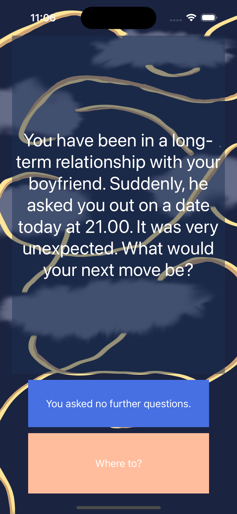

# Story Game

This project is created from the materials provided by APPBrewery. The code written in this project is an independent work. Only the supplementary materials, such as logo, images where borrowed from the source below.

This project covers the UIButtons change the label according to the prompt provided and studtures. To perform simple switch between the storylines comparision and if-else statment were used.

>This is a companion project to The App Brewery's Complete App Development Bootcamp, check out the full course at [www.appbrewery.co](https://www.appbrewery.co/)

